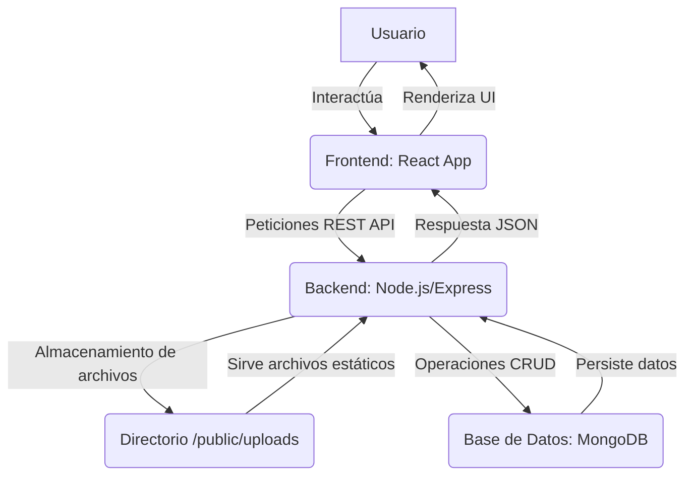
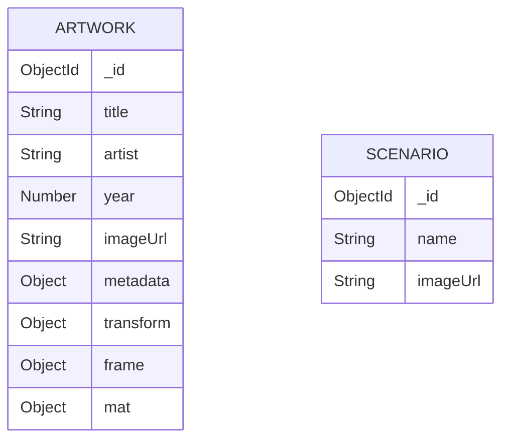

# ArtSetup - Virtual Art Staging

ArtSetup es una aplicación web interactiva que permite a artistas, diseñadores y entusiastas del arte visualizar obras de arte en diferentes escenarios virtuales. Sube tus propias obras y fondos, y utiliza un completo set de herramientas para ajustar la perspectiva, el tamaño, la rotación y el enmarcado para crear la composición perfecta.

## Repositorio

El código fuente del proyecto está alojado en GitHub. Puedes clonarlo desde aquí:
[https://github.com/duckroman/art_setup.git](https://github.com/duckroman/art_setup.git)

## Características Principales

- **Galería de Obras:** Sube tus obras de arte y gestiona tu colección personal.
- **Escenarios Personalizados:** Utiliza los escenarios predeterminados o sube tus propias imágenes de fondo.
- **Editor Multi-obra:** Selecciona múltiples obras de tu galería y llévalas al editor para componer una escena completa.
- **Controles de Transformación 3D:**
  - Ajusta la **perspectiva**, y las rotaciones en los ejes **X** e **Y** para simular profundidad y ángulo.
  - **Rotación (Eje Z):** Gira la obra sobre su propio eje.
  - **Escala:** Aumenta o disminuye el tamaño de la obra.
- **Posicionamiento Libre:** Arrastra cada obra directamente sobre el lienzo para colocarla.
- **Enmarcado Profesional:**
  - **Marco:** Activa un marco personalizable, elige su color y ajusta su grosor.
  - **Marialuisa (Passe-partout):** Añade un segundo marco interior (mat) y ajusta su grosor.
- **Persistencia de Datos:** Todas tus obras, escenarios y sus transformaciones se guardan en una base de datos.
- **Deshacer/Rehacer:** Navega por el historial de tus modificaciones en el editor.

## Tecnología Utilizada

- **Frontend:** React, TypeScript, Vite, Tailwind CSS, react-rnd, use-debounce, html2canvas
- **Backend:** Node.js, Express, TypeScript, Mongoose, Multer, dotenv
- **Base de Datos:** MongoDB

## Arquitectura del Proyecto

La aplicación sigue una arquitectura cliente-servidor desacoplada, con un frontend en React y un backend de API REST en Node.js/Express.

### Diagrama de Flujo de Datos



### Estructura de Archivos

```
c:/Users/jroma/Documents/IA/ArtSetup/
├───.gitignore
├───prompt.txt
├───README.md
├───backend/
│   ├───.env
│   ├───package.json
│   ├───src/
│   │   ├───server.ts             # Punto de entrada del servidor
│   │   ├───controllers/
│   │   │   ├───artworkController.ts
│   │   │   ├───generatorController.ts
│   │   │   └───scenarioController.ts
│   │   ├───middleware/
│   │   │   └───upload.ts         # Middleware para subida de archivos (Multer)
│   │   ├───models/
│   │   │   ├───Artwork.ts        # Modelo de datos para Obras de Arte
│   │   │   └───Scenario.ts       # Modelo de datos para Escenarios
│   │   └───routes/
│   │       ├───artworks.ts
│   │       ├───generator.ts
│   │       └───scenarios.ts
│   └───public/
│       └───uploads/              # Directorio para imágenes subidas
└───frontend/
    ├───package.json
    ├───vite.config.ts
    ├───src/
    │   ├───App.tsx               # Componente raíz y enrutador
    │   ├───main.tsx              # Punto de entrada del cliente
    │   ├───pages/
    │   │   └───HomePage.tsx      # Componente principal (Galería y Editor)
    │   ├───components/
    │   │   ├───ArtworkForm.tsx
    │   │   └───FileUploader.tsx
    │   └───assets/               # Imágenes y recursos estáticos
    └───public/
```

### Diagrama Relacional (Modelos de Datos)

La base de datos MongoDB contiene dos colecciones principales que no tienen una relación estricta a nivel de base de datos, pero que se combinan en la lógica del frontend.



## Indicaciones de Implementación (Desarrollo)

Sigue estos pasos para ejecutar la aplicación en tu máquina local.

**Requisitos:**
- Node.js (v18 o superior)
- MongoDB (local o en un servicio como MongoDB Atlas)

**1. Clonar el Repositorio:**

```bash
git clone https://github.com/duckroman/art_setup.git
cd art_setup
```

**2. Configurar y Ejecutar el Backend:**

```bash
# Navega a la carpeta del backend
cd backend

# Instala las dependencias
npm install

# Crea un archivo .env en la raíz de la carpeta `backend` y configúralo.
# Reemplaza <TU_MONGO_URI> con la URL de tu base de datos MongoDB.
# Ejemplo de .env:
# PORT=5000
# MONGO_URI=mongodb://localhost:27017/artsetup

# Inicia el servidor de desarrollo (se reiniciará con cada cambio)
npm run dev
```
El servidor backend se ejecutará en `http://localhost:5000`.

**3. Configurar y Ejecutar el Frontend:**

```bash
# Desde otra terminal, navega a la carpeta del frontend
cd frontend

# Instala las dependencias
npm install

# Inicia el servidor de desarrollo de Vite
npm run dev
```
La aplicación estará disponible en `http://localhost:5173` (o el puerto que Vite indique).

## Indicaciones de Uso para el Usuario

1.  **Vista de Galería:**
    -   La aplicación se inicia en la galería, mostrando las obras de arte existentes.
    -   Para subir una nueva obra, arrastra un archivo de imagen al área designada o haz clic para abrir el selector de archivos.
    -   Completa el formulario con los detalles de la obra (título, artista, año).
    -   Haz clic en una o más obras para seleccionarlas. Las obras seleccionadas se resaltarán.

2.  **Vista de Editor:**
    -   Con al menos una obra seleccionada, haz clic en el botón "Ir al Editor".
    -   Serás llevado a la vista del editor, donde las obras seleccionadas aparecerán sobre un escenario.
    -   **Cambiar Escenario:** Usa el panel lateral para subir tu propio escenario o seleccionar uno de la lista.
    -   **Manipular Obras:**
        -   Haz clic en una obra en el escenario para seleccionarla. Aparecerán sus controles en el panel izquierdo.
        -   Arrastra la obra para moverla.
        -   Usa los controles deslizantes para ajustar la **perspectiva 3D, rotación, escala, marco y marialuisa**.
    -   **Volver a la Galería:** Haz clic en "Volver a la Galería" para regresar a la vista principal. Todos los cambios se guardan automáticamente.
